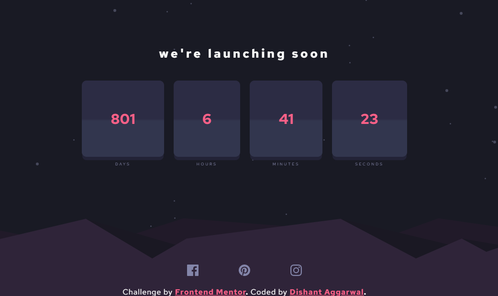

<!-- @format -->

# Frontend Mentor - Launch countdown timer solution

This is a solution to the [Launch countdown timer challenge on Frontend Mentor](https://www.frontendmentor.io/challenges/launch-countdown-timer-N0XkGfyz-). Frontend Mentor challenges help you improve your coding skills by building realistic projects.

## Table of contents

- [Overview](#overview)
  - [The challenge](#the-challenge)
  - [Screenshot](#screenshot)
  - [Links](#links)
- [My process](#my-process)
  - [Built with](#built-with)
  - [What I learned](#what-i-learned)
- [Author](#author)

**Note: Delete this note and update the table of contents based on what sections you keep.**

## Overview

### The challenge

Users should be able to:

- See hover states for all interactive elements on the page
- See a live countdown timer that ticks down every second (start the count at 14 days)
- **Bonus**: When a number changes, make the card flip from the middle

### Screenshot

### Links

- Solution URL: [Github](https://github.com/dishantagg24/launch-countdown-timer)
- Live Site URL: [Vercel](https://launch-countdown-timer-dishantagg24.vercel.app/)

## My process

### Built with

- HTML
- CSS
- Javascript
- React
- CSS Custom Properties

### What I learned

After implementing this solution, I understand the use of setInterval in React.

## Author

- Website - [Dishant Aggarwal](https://portfolio-site-dishantagg24.vercel.app/)
